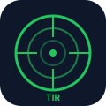

<p align="center">
  
</p>

<h1 align="center">ShaffofTIR</h1>

<p align="center">
  Transparent Shooting Range Management System
</p>

<p align="center">
  
  
  
  
  
</p>

---

## Overview

ShaffofTIR is a comprehensive shooting range management platform built for military and law enforcement training facilities. It provides end-to-end management of shooting sessions, safety compliance, equipment tracking, personnel management, and real-time range monitoring.

The system operates with five distinct user roles, each with a tailored interface and permission scope:

| Role | Access Level | Description |
|------|-------------|-------------|
| SUPER_ADMIN | Full system | All modules, settings, personnel, equipment, and analytics |
| MANAGER | Regional oversight | Command center, analytics, reports, personnel within assigned region |
| INSTRUCTOR | Training operations | Session creation, results review, training plans, materials |
| EMPLOYEE | Individual access | Personal results, training materials, safety certification |
| TECHSPEC | Infrastructure only | Range equipment, cameras, weapons inventory, network diagnostics |

## Architecture

```
shaffoftir/
  src/
    api/            API client modules (axios wrappers, scoring, image URL resolution)
    components/      Reusable UI components
      layout/       AppShell, AppSidebar, AppTopbar
      session/      Session creation, shot tables, target viewer
      target/       Target hit visualization
      ui/           LoadingState, KPICard, ErrorState, FileDropZone
    data/           Static data modules (republic hierarchy, units, employees)
    i18n/           Internationalization (UZ/RU)
    pages/          48 page components (one per route)
    router/         Route definitions with role-based guards
    stores/         Pinia stores (auth, master data, sessions, UI state)
    utils/          Utility functions
    types/          TypeScript type definitions
  backend/          Django REST Framework backend (Python 3.11+)
  public/           Static assets
  dist/             Production build output
  tests/            Unit and integration tests
  docs/             Additional documentation
```

### Frontend Stack

- **Vue 3.4** with Composition API and `<script setup>` syntax
- **TypeScript 5.4** for type-safe development
- **Vite 5.4** as the build tool and dev server
- **Pinia** for state management
- **Vue Router 4** with role-based route guards
- **Tailwind CSS 3.4** for utility-first styling
- **Lucide Icons** for consistent iconography
- **i18n** with full Uzbek and Russian localization

### Backend Stack

- **Python 3.11+** with Django 4.2
- **Django REST Framework 3.15**
- **PostgreSQL** as the primary database
- **JWT Authentication** with refresh token rotation
- **Celery** for async task processing (planned)
- **Redis** for caching and session management (planned)

## Getting Started

### Prerequisites

- Node.js 20 or higher
- npm 10 or higher
- Python 3.11+ (for backend)
- PostgreSQL 14+ (for backend)

### Frontend Installation

```bash
git clone https://github.com/farhodmuxtorov17-stack/ShaffofTIR.git
cd ShaffofTIR
npm install
```

### Development Server

```bash
npm run dev
```

The development server starts at `http://localhost:5173`.

### Production Build

```bash
npm run build
```

Output is generated in the `dist/` directory.

### Environment Variables

Copy `.env.example` to `.env` and configure:

```bash
VITE_API_URL=https://your-api-endpoint.com
VITE_API_URL_EXTENDED=https://your-extended-api.com
```

## Key Features

### Command Center
Three-level drill-down hierarchy (Republic, Region, District, Unit) with traffic-light KPI indicators. Managers can track readiness scores across the entire organizational structure.

### Safety Certification
Mandatory TB (Safety) course with 4 sections covering range rules, weapon handling, firing line protocols, and emergency procedures. A 10-question test requires 100% correct answers for range access. Progress is persisted in localStorage.

### Session Management
Full lifecycle from session request through live execution to result review. Instructors can create sessions, assign weapons, record shots, and generate protocols with PDF export.

### Protocol System
Formal shooting protocols with multi-stage approval workflow. Protocols in APPROVED or ARCHIVED status are locked from editing.

### Equipment Tracking
Real-time inventory of weapons by type, status, and assignment. Technical specialists can monitor camera status, network topology, and system health.

### Analytics
Performance trends, comparison tools, group analytics, and individual soldier tracking with visual KPI dashboards.

## Internationalization

The system supports two languages:
- **Uzbek (uz)** - Primary language
- **Russian (ru)** - Secondary language

Language files are in `src/i18n/` with reactive locale switching. Uzbek text uses the U+02BB character (OKINA) for proper apostrophe rendering.

## Testing

```bash
npm run test          # Unit tests with Vitest
npm run test:e2e      # E2E tests with Playwright
```

## Deployment

The frontend is deployed via Netlify with automatic builds on push to `main`.

```bash
npm run build
npx netlify deploy --prod --dir=dist
```

### Netlify Configuration

See `netlify.toml` for build settings, API proxy redirects, and cache headers.

## Role-Based Access Control

Route guards are defined in `src/router/index.ts`. Each route specifies allowed roles:

```typescript
{ path: '/training/materials', roles: ['SUPER_ADMIN', 'MANAGER', 'INSTRUCTOR', 'EMPLOYEE', 'TECHSPEC'] }
```

The sidebar navigation adapts dynamically based on the authenticated user's role.

## License

This project is licensed under the MIT License. See `LICENSE` for details.

## Contributing

See `CONTRIBUTING.md` for development guidelines, code style, and pull request process.
